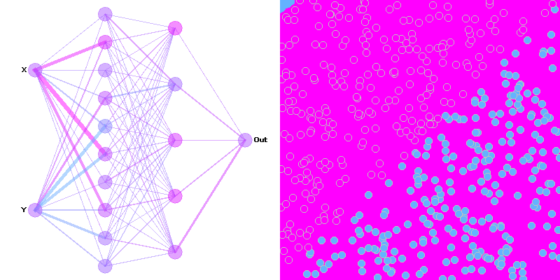
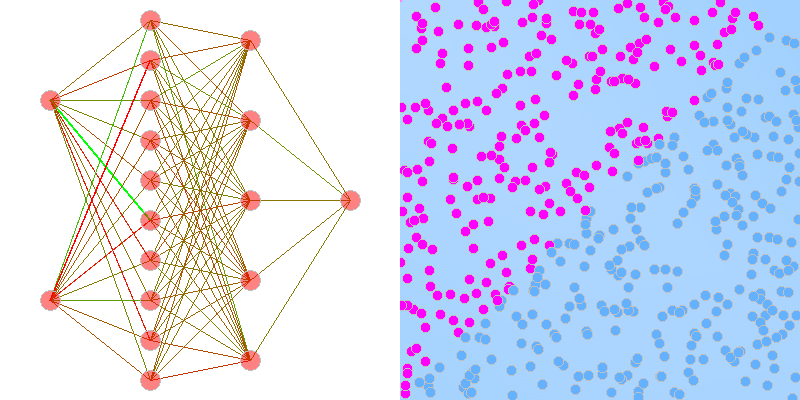

# Feedforward neural network's hypothesis space visualization

A neural network can only have an arbitrary but fixed hypothesis space for a certain training dataset. This repository visualize the internal parameters of a neural network in dependent with the training data.

### Motivation

Overfitting is an usual problem where a neural network learns from noise in the data (assuming the data is rare and the capacity of the networks is siginificantly greater than neccessary. Once in overfitting, the internal parameters of the network becomes greater, making the performance in the training dataset better. However the parameters don't work well with new data.

The visualization of this project shall enable some insights into the structure of an overfitting neural network.

### Implementation

The implementation was done in pure Kotlin. The linear algebra works got help by `Nd4j`.

The training data will be splitted into two parts. The left top part of the input space will be blue and the right bottom part of the input space will be pink. From the whole input space random data points will be sampled and fed into the neural network. After each training epoch the neural network's prediction on the whole space will visualized. 

### Results

###### Simple training data with less complex topology

###### Advanced training data with no possible way to draw a dividing line between two classes

###### Another non-trivial training data set

### References
- [Deep learning book](https://www.deeplearningbook.org/)
